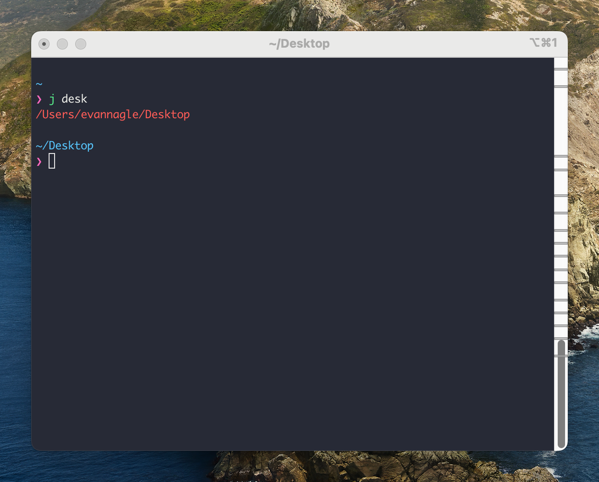

# Jump!

Jump! is an [Alfred Workflow](https://www.alfredapp.com/workflows/) for quickly opening directories in Finder ala [autojump](https://github.com/wting/autojump).

If you like doing this:

You can do the same in Alfred:

## Setup

- [Download](Jump!.alfredworkflow) and install the workflow.
- Review and update the environment variables, if necessary.
- Jump!

## Other resources

- [wting/autojump: A cd command that learns - easily navigate directories from the command line](https://github.com/wting/autojump)
- [Alfred Workflows - Extend Alfred and Boost Your Productivity](https://www.alfredapp.com/workflows/)
